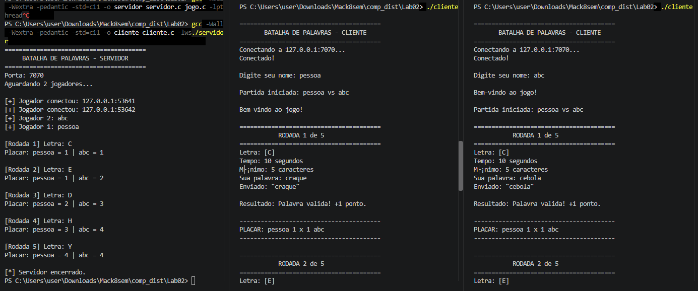
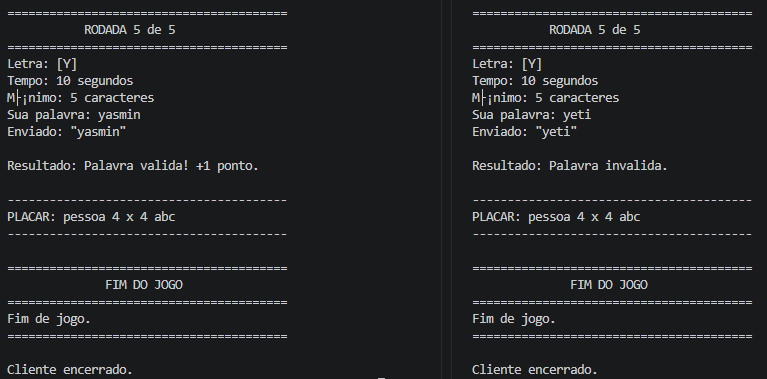

# Atividade de sockets - Batalha de palavras

## 1. Nome e RA Integrantes do grupo
**Tiago Silveira Lopes, RA: 10417600**

## 2. Link Repositório

**Link:** https://github.com/tiagosilveira1/comp-dist-atividades

## 3. Descrição

Batalha de palavras feito com sockets, onde um servidor aceita conexões de, no máximo, dois clientes (quantidade necessária para iniciar a partida).

O servidor aguarda a conexão de dois jogadores.

Quando os dois jogadores estiverem conectados:

cada jogador informa seu nome;
o servidor inicia a partida;
uma letra é sorteada;
os dois jogadores recebem a letra;
os jogadores possuem 10 segundos para responder;
o servidor valida as respostas;
o placar é atualizado;
o processo é repetido por 5 rodadas;
o resultado final é enviado aos jogadores.

**Obs: programa executado e compilado com Windows, com utilização de ifdef _WIN32 e else para suporte da plataforma.**

## 4. Processo de compilação

A versão do GCC utilizada foi 14.2.0

A compilação pode ser realizada utilizando o Makefile:

make

Para remover os arquivos gerados:

make clean

**Compilação Manual**

Cliente.c:
``
gcc -Wall -Wextra -pedantic -std=c11 -o cliente cliente.c -lws2_32
``

Servidor.c:
``
gcc -Wall -Wextra -pedantic -std=c11 -o servidor servidor.c jogo.c -lpthread
``

## 5. Execução

1. Iniciar o servidor

Utilizando a porta padrão:

``
./servidor
``

Ou especificando outra porta:

``
./servidor 9000
``

O servidor ficará aguardando conexões de jogadores.

**2. Iniciar os clientes**

Em dois terminais diferentes:

``
./cliente
``

Por padrão, o cliente conecta em:

127.0.0.1:7070

Também é possível informar o IP e a porta:

``
./cliente 127.0.0.1 9000
``

Para utilizar outro computador da mesma rede:

``
./cliente 192.168.1.10 7070
``

## 6. Estrutura do projeto

Seguiu conforme README.md dos requisitos do projeto no [github do professor](https://github.com/traue/26.2-comp-dist-06D/tree/main/01_sockets/atividade):

| **Arquivo** | **Responsabilidade** |
| :----: | :----: |
| protocolo.h | Define constantes, limites, porta padrão e tipos de mensagens utilizados na comunicação. |
| jogo.h | Declara as funções relacionadas à lógica do jogo. |
| jogo.c | Implementa a validação das palavras, comunicação formatada pelo protocolo, controle de tempo e funções auxiliares. |
| servidor.c | Implementa o servidor TCP, gerenciamento dos jogadores, criação das threads e controle das partidas. |
| cliente.c | Implementa o cliente TCP, interface textual, recebimento das mensagens e envio das respostas. |
| Makefile | Automatizador do processo de compilação. |
| README.md | Documentação do projeto. |

## 7. Protocolo de Comunicação

A comunicação entre cliente e servidor utiliza TCP.

As mensagens são transmitidas como strings de texto, utilizando o caractere | como separador entre os campos conforme indicado pelo template da atividade:

**Obs: Considerar '/' como '|'.**

**Servidor --> Cliente**

| **Tipo** | **Formato** | **Descrição** |
| :----: | :----: | :----: |
| MSG | MSG/texto | Enviar mensagem qualquer |
| NOME | NOME/ | Solicitar nome |
| AGUARDE | AGUARDE/texto | Informa que cliente deve aguardar |
| RODADA | RODADA/num|letra|tempo | Informa início de uma rodada |
| PALAVRA | PALAVRA/ | | Solicitar palavra |
| RESULTADO | RESULTADO/texto | Informa resultado ao final de uma rodada |
| PLACAR | PLACAR/nome1/pts1/nome2/pts2 | Informa placar |
| FIM | FIM/texto | Informa encerramento da partida |
| FULL | FULL/texto | Informa que o servidor está cheio |

Obs: todas as mensagens Servidor --> Cliente são todas as definições de mensagens do **protocolo.h**, com exceção de TIMEOUT.

**Cliente --> Servidor**

| **Tipo** | **Formato** | **Descrição** |
| :----: | :----: | :----: |
| NOME | NOME/texto | Enviar nome do jogador |
| PALAVRA | PALAVRA/texto | Enviar palavra para servidor |
| TIMEOUT | TIMEOUT/ | Indica para o cliente que o tempo esgotou |

## 8. Conceitos

| **Conceito** | **Aplicação no Projeto** |
| :----: | :----: |
| Arquitetura cliente-servidor | O servidor centraliza o controle da partida e os clientes representam os jogadores. |
| Comunicação em rede | Utiliza protocolo TCP |
| Protocolo de aplicação | O projeto define mensagens próprias em protocolo.h |
| Concorrência | O servidor utiliza pthreads para atender os clientes. |
| Sincronização | Os jogadores precisam acompanhar o mesmo estado da rodada. |
| Timeout | select() é utilizado para limitar o tempo de resposta. |
| Tolerância a falhas | O projeto verifica erros de comunicação e desconexões. |
| Modularização | A lógica foi dividida entre arquivos .c e .h. |
| Validação de dados | As palavras recebidas são verificadas antes da pontuação. |

- Comunicação em rede: função abaixo para criação do servidor em TCP: 
``
socket_servidor = socket(AF_INET,SOCK_STREAM,0);
``

- Concorrência: o trecho da main a seguir é usado para atender jogadores

``

if (pthread_create(&thread,NULL,atender_jogador,arg) != 0) {

            perror("pthread_create");
            free(arg);
            FECHAR_SOCKET(socket_cliente);
            pthread_mutex_lock(&mutex_jogadores);
            jogadores[indice].conectado = 0;
            jogadores_conectados--;
            pthread_mutex_unlock(&mutex_jogadores);

            continue;
        }
        
``

- Timeout: a função ler_com_timeout() dentro de cliente.c utilizada select() e outras funções no caso do Windows para detecção de inputs: kbhit(), _getch(), isprint(), putchar() e fflush(stdout).
- Tolerância a falhas: Utilização diversa no código, fechando o socket de jogadores que saíram, atualizando a estrutura Jogador implementada e valores de retorno recv() que indicam desconexão do cliente.

## 9. Funções e fluxo de execução de cada arquivo C

- **Servidor.c**:


```text
Inicia servidor
     |
     ↓
Cria socket TCP
     |
     ↓
Configura porta/IP
     |
     ↓
bind() + listen()
     |
     ↓
Espera jogadores
     |
     ↓
accept() → jogador 1
accept() → jogador 2
     |
     ↓
Cria uma thread para cada jogador
     |
     ↓
Cada thread recebe o nome
     |
     ↓
Espera os 2 nomes
     |
     ↓
Inicia a partida
     |
     ↓
Executa as rodadas
     |
     ↓
Envia resultados e placar
     |
     ↓
Finaliza conexões
```

Funções utilizadas em **Servidor.c**:

| **Função** | **Objetivo** |
| :----: | :----: |
| enviar_mensagem() | Enviar uma mensagem completa pelo socket TCP |
| receber_mensagem() | Receber uma mensagem do cliente até encontrar \n |
| enviar_para_jogadores() | Enviar uma mensagem para os dois jogadores |
| enviar_nome() | Pedir ao cliente que informe seu nome |
| enviar_aguarde() | Informar ao jogador que ele deve aguardar |
| enviar_rodada() | Enviar a letra e informações da rodada |
| enviar_resultado() | Enviar o resultado da rodada |
| enviar_placar() | Enviar o placar atual |
| enviar_fim() | Informar o encerramento da partida |
| atender_jogador() | Thread responsável por atender individualmente um jogador |
| criar_servidor() | Criar e configurar o socket TCP do servidor |
| tratar_interrupcao() | Tratar encerramento do servidor, como Ctrl+C |
| main() | Controlar todo o ciclo de execução do servidor |

- **Cliente.c**:

 ```text
     |
     ↓
Inicia cliente
     |
     ↓
Inicializa Winsock (Windows)
     |
     ↓
Lê IP e porta
     |
     ↓
Cria socket TCP
     |
     ↓
connect()
     |
     ↓
Conectado ao servidor
     |
     ↓
Espera mensagens
     |
     ↓
processar_mensagem()
     |
     ├── MSG       → mostra mensagem
     |
     ├── NOME      → pede nome
     |
     ├── AGUARDE   → espera
     |
     ├── RODADA    → pede palavra
     |
     ├── RESULTADO → mostra resultado
     |
     ├── PLACAR    → mostra placar
     |
     └── FIM       → encerra
     |
     ↓
Fecha socket
     |
     ↓
Encerra cliente
```

Funções utilizadas em **Cliente.c**:

| **Função** | **Objetivo** |
| :----: | :----: |
| enviar_mensagem() | Enviar uma mensagem completa para o servidor |
| receber_mensagem() | Receber uma mensagem completa do servidor |
| conectar_servidor() | Criar o socket e conectar o cliente ao servidor |
| ler_com_timeout() | Ler a palavra do jogador respeitando o limite de tempo |
| processar_mensagem() | Interpretar as mensagens recebidas e tomar as ações correspondentes |
| main() | Controla todo o funcionamento do cliente |

- **Jogo.c**:

```text
jogo.c
   │
   ↓
iniciar_partida()
   │
   ├──────────────────────┐
   ↓                      ↓
executar_rodada()     executa 5 vezes
   │
   ↓
gerar_letra()
   │
   ↓
envia letra aos jogadores
   │
   ↓
receber_respostas_rodada()
   │
   ├───────────────┐
   ↓               ↓
jogador 1       jogador 2
   │               │
   └───────┬───────┘
           ↓
    validar_palavra()
           │
           ↓
    compara palavras iguais
           │
           ↓
    atualiza pontuação
           │
           ↓
    envia resultado
           │
           ↓
      envia placar
           │
           ↓
    próxima rodada
```    

Funções utilizadas em **Jogo.c**:

| **Função** | **Objetivo** |
| :----: | :----: |
| receber_respostas_rodada() | Receber as respostas dos dois jogadores dentro do tempo |
| strings_iguais_ignore_case() | Comparar duas palavras |
| iniciar_partida() | Iniciar a partida, executar todas as rodadas e informar o vencedor |
| executar_rodada() | Controlar uma rodada completa |
| validar_palavra() | Verificar se uma palavra atende às regras |
| gerar_letra() | Sortear a letra da rodada |

## 10. Exemplo de execução (print)





## 11. Tecnologias Utilizadas

Linguagem: C

Comunicação: Sockets TCP

Concorrência: POSIX Threads (pthread)

Controle de tempo: select()

Sistema operacional: Windows 10

Compilação: GCC

Automação: Makefile
